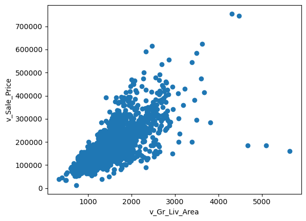
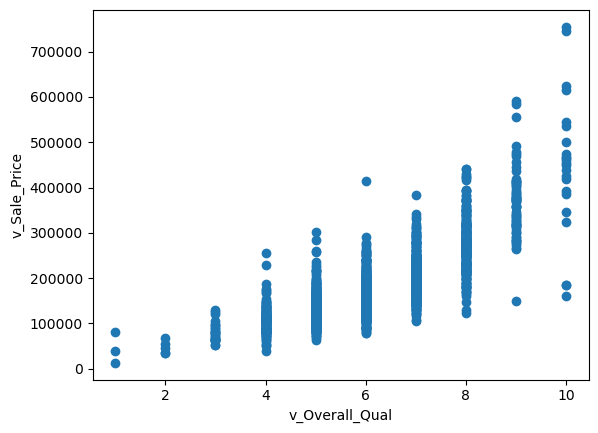
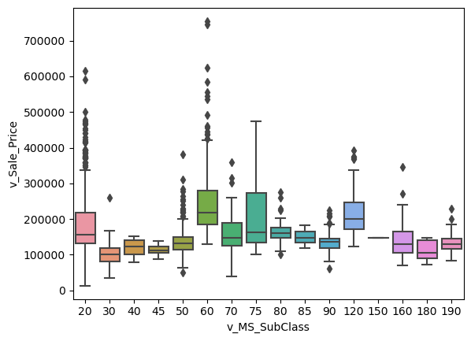
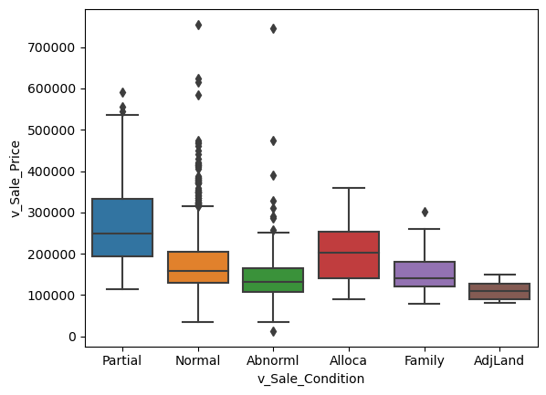
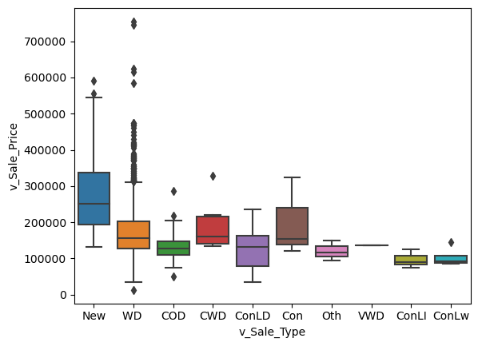

## Part 1: Quick (and dirty) EDA

**TIP: Do this data exploration in a "scrap" file so you can explore quickly and messily.**

_We are going to use this dataset (`input_data2/housing_train.csv`) for the regression and ML assignments, as well as the prediction contest. The general focus will be on modelling the **Sale Price** (`v_SalePrice`)._
   

## EDA section 


```python
import pandas as pd
import numpy as np 

ht = pd.read_csv("input_data2/housing_train.csv")
```

### Exploration


```python
ht.describe()
```


<div>
<style scoped>
    .dataframe tbody tr th:only-of-type {
        vertical-align: middle;
    }

    .dataframe tbody tr th {
        vertical-align: top;
    }

    .dataframe thead th {
        text-align: right;
    }
</style>
<table border="1" class="dataframe">
  <thead>
    <tr style="text-align: right;">
      <th></th>
      <th>v_MS_SubClass</th>
      <th>v_Lot_Frontage</th>
      <th>v_Lot_Area</th>
      <th>v_Overall_Qual</th>
      <th>v_Overall_Cond</th>
      <th>v_Year_Built</th>
      <th>v_Year_Remod/Add</th>
      <th>v_Mas_Vnr_Area</th>
      <th>v_BsmtFin_SF_1</th>
      <th>v_BsmtFin_SF_2</th>
      <th>...</th>
      <th>v_Wood_Deck_SF</th>
      <th>v_Open_Porch_SF</th>
      <th>v_Enclosed_Porch</th>
      <th>v_3Ssn_Porch</th>
      <th>v_Screen_Porch</th>
      <th>v_Pool_Area</th>
      <th>v_Misc_Val</th>
      <th>v_Mo_Sold</th>
      <th>v_Yr_Sold</th>
      <th>v_SalePrice</th>
    </tr>
  </thead>
  <tbody>
    <tr>
      <th>count</th>
      <td>1941.000000</td>
      <td>1620.000000</td>
      <td>1941.000000</td>
      <td>1941.000000</td>
      <td>1941.000000</td>
      <td>1941.000000</td>
      <td>1941.000000</td>
      <td>1923.000000</td>
      <td>1940.000000</td>
      <td>1940.000000</td>
      <td>...</td>
      <td>1941.000000</td>
      <td>1941.000000</td>
      <td>1941.000000</td>
      <td>1941.000000</td>
      <td>1941.000000</td>
      <td>1941.000000</td>
      <td>1941.000000</td>
      <td>1941.000000</td>
      <td>1941.000000</td>
      <td>1941.000000</td>
    </tr>
    <tr>
      <th>mean</th>
      <td>58.088614</td>
      <td>69.301235</td>
      <td>10284.770222</td>
      <td>6.113344</td>
      <td>5.568264</td>
      <td>1971.321999</td>
      <td>1984.073158</td>
      <td>104.846074</td>
      <td>436.986598</td>
      <td>49.247938</td>
      <td>...</td>
      <td>92.458011</td>
      <td>49.157135</td>
      <td>22.947965</td>
      <td>2.249871</td>
      <td>16.249871</td>
      <td>3.386399</td>
      <td>52.553838</td>
      <td>6.431221</td>
      <td>2006.998454</td>
      <td>182033.238022</td>
    </tr>
    <tr>
      <th>std</th>
      <td>42.946015</td>
      <td>23.978101</td>
      <td>7832.295527</td>
      <td>1.401594</td>
      <td>1.087465</td>
      <td>30.209933</td>
      <td>20.837338</td>
      <td>184.982611</td>
      <td>457.815715</td>
      <td>169.555232</td>
      <td>...</td>
      <td>127.020523</td>
      <td>70.296277</td>
      <td>65.249307</td>
      <td>22.416832</td>
      <td>56.748086</td>
      <td>43.695267</td>
      <td>616.064459</td>
      <td>2.745199</td>
      <td>0.801736</td>
      <td>80407.100395</td>
    </tr>
    <tr>
      <th>min</th>
      <td>20.000000</td>
      <td>21.000000</td>
      <td>1470.000000</td>
      <td>1.000000</td>
      <td>1.000000</td>
      <td>1872.000000</td>
      <td>1950.000000</td>
      <td>0.000000</td>
      <td>0.000000</td>
      <td>0.000000</td>
      <td>...</td>
      <td>0.000000</td>
      <td>0.000000</td>
      <td>0.000000</td>
      <td>0.000000</td>
      <td>0.000000</td>
      <td>0.000000</td>
      <td>0.000000</td>
      <td>1.000000</td>
      <td>2006.000000</td>
      <td>13100.000000</td>
    </tr>
    <tr>
      <th>25%</th>
      <td>20.000000</td>
      <td>58.000000</td>
      <td>7420.000000</td>
      <td>5.000000</td>
      <td>5.000000</td>
      <td>1953.000000</td>
      <td>1965.000000</td>
      <td>0.000000</td>
      <td>0.000000</td>
      <td>0.000000</td>
      <td>...</td>
      <td>0.000000</td>
      <td>0.000000</td>
      <td>0.000000</td>
      <td>0.000000</td>
      <td>0.000000</td>
      <td>0.000000</td>
      <td>0.000000</td>
      <td>5.000000</td>
      <td>2006.000000</td>
      <td>130000.000000</td>
    </tr>
    <tr>
      <th>50%</th>
      <td>50.000000</td>
      <td>68.000000</td>
      <td>9450.000000</td>
      <td>6.000000</td>
      <td>5.000000</td>
      <td>1973.000000</td>
      <td>1993.000000</td>
      <td>0.000000</td>
      <td>361.500000</td>
      <td>0.000000</td>
      <td>...</td>
      <td>0.000000</td>
      <td>28.000000</td>
      <td>0.000000</td>
      <td>0.000000</td>
      <td>0.000000</td>
      <td>0.000000</td>
      <td>0.000000</td>
      <td>6.000000</td>
      <td>2007.000000</td>
      <td>161900.000000</td>
    </tr>
    <tr>
      <th>75%</th>
      <td>70.000000</td>
      <td>80.000000</td>
      <td>11631.000000</td>
      <td>7.000000</td>
      <td>6.000000</td>
      <td>2001.000000</td>
      <td>2004.000000</td>
      <td>168.000000</td>
      <td>735.250000</td>
      <td>0.000000</td>
      <td>...</td>
      <td>168.000000</td>
      <td>72.000000</td>
      <td>0.000000</td>
      <td>0.000000</td>
      <td>0.000000</td>
      <td>0.000000</td>
      <td>0.000000</td>
      <td>8.000000</td>
      <td>2008.000000</td>
      <td>215000.000000</td>
    </tr>
    <tr>
      <th>max</th>
      <td>190.000000</td>
      <td>313.000000</td>
      <td>164660.000000</td>
      <td>10.000000</td>
      <td>9.000000</td>
      <td>2008.000000</td>
      <td>2009.000000</td>
      <td>1600.000000</td>
      <td>5644.000000</td>
      <td>1474.000000</td>
      <td>...</td>
      <td>1424.000000</td>
      <td>742.000000</td>
      <td>1012.000000</td>
      <td>407.000000</td>
      <td>576.000000</td>
      <td>800.000000</td>
      <td>17000.000000</td>
      <td>12.000000</td>
      <td>2008.000000</td>
      <td>755000.000000</td>
    </tr>
  </tbody>
</table>
<p>8 rows × 37 columns</p>
</div>


```python
ht['v_SalePrice'].describe()
```


    count      1941.000000
    mean     182033.238022
    std       80407.100395
    min       13100.000000
    25%      130000.000000
    50%      161900.000000
    75%      215000.000000
    max      755000.000000
    Name: v_SalePrice, dtype: float64


```python
# Check for missing values:
print("Number of missing values:\n", ht.isnull().sum())

# Check for outliers:
print("Summary statistics for numeric columns:\n", ht.describe())

```

    Number of missing values:
     parcel                0
    v_MS_SubClass         0
    v_MS_Zoning           0
    v_Lot_Frontage      321
    v_Lot_Area            0
                       ... 
    v_Mo_Sold             0
    v_Yr_Sold             0
    v_Sale_Type           0
    v_Sale_Condition      0
    v_SalePrice           0
    Length: 81, dtype: int64
    Summary statistics for numeric columns:
            v_MS_SubClass  v_Lot_Frontage     v_Lot_Area  v_Overall_Qual  \
    count    1941.000000     1620.000000    1941.000000     1941.000000   
    mean       58.088614       69.301235   10284.770222        6.113344   
    std        42.946015       23.978101    7832.295527        1.401594   
    min        20.000000       21.000000    1470.000000        1.000000   
    25%        20.000000       58.000000    7420.000000        5.000000   
    50%        50.000000       68.000000    9450.000000        6.000000   
    75%        70.000000       80.000000   11631.000000        7.000000   
    max       190.000000      313.000000  164660.000000       10.000000   
    
           v_Overall_Cond  v_Year_Built  v_Year_Remod/Add  v_Mas_Vnr_Area  \
    count     1941.000000   1941.000000       1941.000000     1923.000000   
    mean         5.568264   1971.321999       1984.073158      104.846074   
    std          1.087465     30.209933         20.837338      184.982611   
    min          1.000000   1872.000000       1950.000000        0.000000   
    25%          5.000000   1953.000000       1965.000000        0.000000   
    50%          5.000000   1973.000000       1993.000000        0.000000   
    75%          6.000000   2001.000000       2004.000000      168.000000   
    max          9.000000   2008.000000       2009.000000     1600.000000   
    
           v_BsmtFin_SF_1  v_BsmtFin_SF_2  ...  v_Wood_Deck_SF  v_Open_Porch_SF  \
    count     1940.000000     1940.000000  ...     1941.000000      1941.000000   
    mean       436.986598       49.247938  ...       92.458011        49.157135   
    std        457.815715      169.555232  ...      127.020523        70.296277   
    min          0.000000        0.000000  ...        0.000000         0.000000   
    25%          0.000000        0.000000  ...        0.000000         0.000000   
    50%        361.500000        0.000000  ...        0.000000        28.000000   
    75%        735.250000        0.000000  ...      168.000000        72.000000   
    max       5644.000000     1474.000000  ...     1424.000000       742.000000   
    
           v_Enclosed_Porch  v_3Ssn_Porch  v_Screen_Porch  v_Pool_Area  \
    count       1941.000000   1941.000000     1941.000000  1941.000000   
    mean          22.947965      2.249871       16.249871     3.386399   
    std           65.249307     22.416832       56.748086    43.695267   
    min            0.000000      0.000000        0.000000     0.000000   
    25%            0.000000      0.000000        0.000000     0.000000   
    50%            0.000000      0.000000        0.000000     0.000000   
    75%            0.000000      0.000000        0.000000     0.000000   
    max         1012.000000    407.000000      576.000000   800.000000   
    
             v_Misc_Val    v_Mo_Sold    v_Yr_Sold    v_SalePrice  
    count   1941.000000  1941.000000  1941.000000    1941.000000  
    mean      52.553838     6.431221  2006.998454  182033.238022  
    std      616.064459     2.745199     0.801736   80407.100395  
    min        0.000000     1.000000  2006.000000   13100.000000  
    25%        0.000000     5.000000  2006.000000  130000.000000  
    50%        0.000000     6.000000  2007.000000  161900.000000  
    75%        0.000000     8.000000  2008.000000  215000.000000  
    max    17000.000000    12.000000  2008.000000  755000.000000  
    
    [8 rows x 37 columns]


### relationship between v_Sale_Price and other variables.


```python
import matplotlib.pyplot as plt
import seaborn as sns
```


```python
#numeric variables- SCATTERPLOTS 
```


```python
# create scatterplot of v_Sale_Price vs v_Gr_Liv_Area
plt.scatter(ht['v_Gr_Liv_Area'], ht['v_SalePrice'])
plt.xlabel('v_Gr_Liv_Area')
plt.ylabel('v_Sale_Price')
plt.show()
```


    

    


```python
# create scatterplot of v_Sale_Price vs v_Gr_Liv_Area
plt.scatter(ht['v_Overall_Qual'], ht['v_SalePrice'])
plt.xlabel('v_Overall_Qual')
plt.ylabel('v_Sale_Price')
plt.show()
```


    

    


```python
## categorical variables- BOXPLOTS
```


```python
# create noxplot of v_Sale_Price vs v_MS_SubClass
sns.boxplot(x='v_MS_SubClass', y='v_SalePrice', data=ht)
plt.xlabel('v_MS_SubClass')
plt.ylabel('v_Sale_Price')
plt.show()
```


    

    


```python
# create noxplot of v_Sale_Price vs v_Sale_Condition
sns.boxplot(x='v_Sale_Condition', y='v_SalePrice', data=ht)
plt.xlabel('v_Sale_Condition')
plt.ylabel('v_Sale_Price')
plt.show()
```


    

    


```python
sns.boxplot(x='v_Sale_Type', y='v_SalePrice', data=ht)
plt.xlabel('v_Sale_Type')
plt.ylabel('v_Sale_Price')
plt.show()
```


    

    


## Part 1: EDA

_Insert cells as needed below to write a short EDA/data section that summarizes the data for someone who has never opened it before._ 
- Answer essential questions about the dataset (observation units, time period, sample size, many of the questions above) 
- Note any issues you have with the data (variable X has problem Y that needs to get addressed before using it in regressions or a prediction model because Z)
- Present any visual results you think are interesting or important

The dataset includes 81 variables with 1941 rows. This dataset contain information related to real estate properties, including various categorical and numerical features. 

The categorical data includes: v_MS_SubClass, v_MS_Zoning, v_Street, v_Alley, v_Lot_Shape, v_Land_Contour, v_Utilities, v_Lot_Config, v_Land_Slope, v_Neighborhood, v_Condition_1, v_Condition_2, v_Bldg_Type, v_House_Style, v_Roof_Style, v_Roof_Matl, v_Exterior_1st, v_Exterior_2nd, v_Mas_Vnr_Type, v_Exter_Qual, v_Exter_Cond, v_Foundation, v_Bsmt_Qual, v_Bsmt_Cond, v_Bsmt_Exposure, v_BsmtFin_Type_1, v_BsmtFin_Type_2, v_Heating, v_Heating_QC, v_Central_Air, v_Electrical, v_Kitchen_Qual, v_Functional, v_Fireplace_Qu, v_Garage_Type, v_Garage_Finish, v_Garage_Qual, v_Garage_Cond, v_Paved_Drive, v_Pool_QC, v_Fence, v_Misc_Feature, v_Sale_Type, and v_Sale_Condition. 

The numerical data includes: parcel, v_Lot_Frontage, v_Lot_Area, v_Overall_Qual, v_Overall_Cond, v_Year_Built, v_Year_Remod/Add, v_Mas_Vnr_Area, v_BsmtFin_SF_1, v_BsmtFin_SF_2, v_Bsmt_Unf_SF, v_Total_Bsmt_SF, v_1st_Flr_SF, v_2nd_Flr_SF, v_Low_Qual_Fin_SF, v_Gr_Liv_Area, v_Bsmt_Full_Bath, v_Bsmt_Half_Bath, v_Full_Bath, v_Half_Bath, v_Bedroom_AbvGr, v_Kitchen_AbvGr, v_TotRms_AbvGrd, v_Fireplaces, v_Garage_Yr_Blt, v_Garage_Cars, v_Garage_Area, v_Wood_Deck_SF, v_Open_Porch_SF, v_Enclosed_Porch, v_3Ssn_Porch, v_Screen_Porch, v_Pool_Area, v_Misc_Val, v_Mo_Sold, v_Yr_Sold, and v_SalePrice.

Key finding show that the numerical variable v_SalePrice contains a list sale prices for various properties. The values range from 13100 to 755000. The mean sale price is 182033.238022 and the standard deviation of 80407.100395. 

## Part 2: Running Regressions

**Run these regressions on the RAW data, even if you found data issues that you think should be addressed.**

_Insert cells as needed below to run these regressions. Note that $i$ is indexing a given house, and $t$ indexes the year of sale._ 

1. $\text{Sale Price}_{i,t} = \alpha + \beta_1 * \text{v_Lot_Area}$
1. $\text{Sale Price}_{i,t} = \alpha + \beta_1 * log(\text{v_Lot_Area})$
1. $log(\text{Sale Price}_{i,t}) = \alpha + \beta_1 * \text{v_Lot_Area}$
1. $log(\text{Sale Price}_{i,t}) = \alpha + \beta_1 * log(\text{v_Lot_Area})$
1. $log(\text{Sale Price}_{i,t}) = \alpha + \beta_1 * \text{v_Yr_Sold}$
1. $log(\text{Sale Price}_{i,t}) = \alpha + \beta_1 * (\text{v_Yr_Sold==2007})+ \beta_2 * (\text{v_Yr_Sold==2008})$
1. Choose your own adventure: Pick any five variables from the dataset that you think will generate good R2. Use them in a regression of $log(\text{Sale Price}_{i,t})$ 
    - Tip: You can transform/create these five variables however you want, even if it creates extra variables. For example: I'd count Model 6 above as only using one variable: `v_Yr_Sold`.
    - I got an R2 of 0.877 with just "5" variables. How close can you get? I won't be shocked if someone beats that!
    

**Bonus formatting trick:** Instead of reporting all regressions separately, report all seven regressions in a _single_ table using `summary_col`.


```python
import statsmodels.api as sm
from statsmodels.iolib.summary2 import summary_col
```


```python
#1
reg1 = sm.OLS(endog=ht['v_SalePrice'], exog=sm.add_constant(ht['v_Lot_Area'])).fit()
reg1.summary()
```


<table class="simpletable">
<caption>OLS Regression Results</caption>
<tr>
  <th>Dep. Variable:</th>       <td>v_SalePrice</td>   <th>  R-squared:         </th> <td>   0.067</td> 
</tr>
<tr>
  <th>Model:</th>                   <td>OLS</td>       <th>  Adj. R-squared:    </th> <td>   0.066</td> 
</tr>
<tr>
  <th>Method:</th>             <td>Least Squares</td>  <th>  F-statistic:       </th> <td>   138.3</td> 
</tr>
<tr>
  <th>Date:</th>             <td>Wed, 29 Mar 2023</td> <th>  Prob (F-statistic):</th> <td>6.82e-31</td> 
</tr>
<tr>
  <th>Time:</th>                 <td>16:28:50</td>     <th>  Log-Likelihood:    </th> <td> -24610.</td> 
</tr>
<tr>
  <th>No. Observations:</th>      <td>  1941</td>      <th>  AIC:               </th> <td>4.922e+04</td>
</tr>
<tr>
  <th>Df Residuals:</th>          <td>  1939</td>      <th>  BIC:               </th> <td>4.924e+04</td>
</tr>
<tr>
  <th>Df Model:</th>              <td>     1</td>      <th>                     </th>     <td> </td>    
</tr>
<tr>
  <th>Covariance Type:</th>      <td>nonrobust</td>    <th>                     </th>     <td> </td>    
</tr>
</table>
<table class="simpletable">
<tr>
       <td></td>         <th>coef</th>     <th>std err</th>      <th>t</th>      <th>P>|t|</th>  <th>[0.025</th>    <th>0.975]</th>  
</tr>
<tr>
  <th>const</th>      <td> 1.548e+05</td> <td> 2911.591</td> <td>   53.163</td> <td> 0.000</td> <td> 1.49e+05</td> <td>  1.6e+05</td>
</tr>
<tr>
  <th>v_Lot_Area</th> <td>    2.6489</td> <td>    0.225</td> <td>   11.760</td> <td> 0.000</td> <td>    2.207</td> <td>    3.091</td>
</tr>
</table>
<table class="simpletable">
<tr>
  <th>Omnibus:</th>       <td>668.513</td> <th>  Durbin-Watson:     </th> <td>   1.064</td>
</tr>
<tr>
  <th>Prob(Omnibus):</th> <td> 0.000</td>  <th>  Jarque-Bera (JB):  </th> <td>3001.894</td>
</tr>
<tr>
  <th>Skew:</th>          <td> 1.595</td>  <th>  Prob(JB):          </th> <td>    0.00</td>
</tr>
<tr>
  <th>Kurtosis:</th>      <td> 8.191</td>  <th>  Cond. No.          </th> <td>2.13e+04</td>
</tr>
</table><br/><br/>Notes:<br/>[1] Standard Errors assume that the covariance matrix of the errors is correctly specified.<br/>[2] The condition number is large, 2.13e+04. This might indicate that there are<br/>strong multicollinearity or other numerical problems.


```python
#2
reg2 = sm.OLS(endog=ht['v_SalePrice'], exog=sm.add_constant(np.log(ht['v_Lot_Area']))).fit()
reg2.summary()
```


<table class="simpletable">
<caption>OLS Regression Results</caption>
<tr>
  <th>Dep. Variable:</th>       <td>v_SalePrice</td>   <th>  R-squared:         </th> <td>   0.128</td> 
</tr>
<tr>
  <th>Model:</th>                   <td>OLS</td>       <th>  Adj. R-squared:    </th> <td>   0.128</td> 
</tr>
<tr>
  <th>Method:</th>             <td>Least Squares</td>  <th>  F-statistic:       </th> <td>   285.6</td> 
</tr>
<tr>
  <th>Date:</th>             <td>Wed, 29 Mar 2023</td> <th>  Prob (F-statistic):</th> <td>6.95e-60</td> 
</tr>
<tr>
  <th>Time:</th>                 <td>16:28:50</td>     <th>  Log-Likelihood:    </th> <td> -24544.</td> 
</tr>
<tr>
  <th>No. Observations:</th>      <td>  1941</td>      <th>  AIC:               </th> <td>4.909e+04</td>
</tr>
<tr>
  <th>Df Residuals:</th>          <td>  1939</td>      <th>  BIC:               </th> <td>4.910e+04</td>
</tr>
<tr>
  <th>Df Model:</th>              <td>     1</td>      <th>                     </th>     <td> </td>    
</tr>
<tr>
  <th>Covariance Type:</th>      <td>nonrobust</td>    <th>                     </th>     <td> </td>    
</tr>
</table>
<table class="simpletable">
<tr>
       <td></td>         <th>coef</th>     <th>std err</th>      <th>t</th>      <th>P>|t|</th>  <th>[0.025</th>    <th>0.975]</th>  
</tr>
<tr>
  <th>const</th>      <td>-3.279e+05</td> <td> 3.02e+04</td> <td>  -10.850</td> <td> 0.000</td> <td>-3.87e+05</td> <td>-2.69e+05</td>
</tr>
<tr>
  <th>v_Lot_Area</th> <td> 5.603e+04</td> <td> 3315.139</td> <td>   16.901</td> <td> 0.000</td> <td> 4.95e+04</td> <td> 6.25e+04</td>
</tr>
</table>
<table class="simpletable">
<tr>
  <th>Omnibus:</th>       <td>650.067</td> <th>  Durbin-Watson:     </th> <td>   1.042</td>
</tr>
<tr>
  <th>Prob(Omnibus):</th> <td> 0.000</td>  <th>  Jarque-Bera (JB):  </th> <td>2623.687</td>
</tr>
<tr>
  <th>Skew:</th>          <td> 1.587</td>  <th>  Prob(JB):          </th> <td>    0.00</td>
</tr>
<tr>
  <th>Kurtosis:</th>      <td> 7.729</td>  <th>  Cond. No.          </th> <td>    164.</td>
</tr>
</table><br/><br/>Notes:<br/>[1] Standard Errors assume that the covariance matrix of the errors is correctly specified.


```python
#3
reg3 = sm.OLS(endog=np.log(ht['v_SalePrice']), exog=sm.add_constant(ht['v_Lot_Area'])).fit()
reg3.summary()
```


<table class="simpletable">
<caption>OLS Regression Results</caption>
<tr>
  <th>Dep. Variable:</th>       <td>v_SalePrice</td>   <th>  R-squared:         </th> <td>   0.065</td>
</tr>
<tr>
  <th>Model:</th>                   <td>OLS</td>       <th>  Adj. R-squared:    </th> <td>   0.064</td>
</tr>
<tr>
  <th>Method:</th>             <td>Least Squares</td>  <th>  F-statistic:       </th> <td>   133.9</td>
</tr>
<tr>
  <th>Date:</th>             <td>Wed, 29 Mar 2023</td> <th>  Prob (F-statistic):</th> <td>5.46e-30</td>
</tr>
<tr>
  <th>Time:</th>                 <td>16:28:50</td>     <th>  Log-Likelihood:    </th> <td> -927.19</td>
</tr>
<tr>
  <th>No. Observations:</th>      <td>  1941</td>      <th>  AIC:               </th> <td>   1858.</td>
</tr>
<tr>
  <th>Df Residuals:</th>          <td>  1939</td>      <th>  BIC:               </th> <td>   1870.</td>
</tr>
<tr>
  <th>Df Model:</th>              <td>     1</td>      <th>                     </th>     <td> </td>   
</tr>
<tr>
  <th>Covariance Type:</th>      <td>nonrobust</td>    <th>                     </th>     <td> </td>   
</tr>
</table>
<table class="simpletable">
<tr>
       <td></td>         <th>coef</th>     <th>std err</th>      <th>t</th>      <th>P>|t|</th>  <th>[0.025</th>    <th>0.975]</th>  
</tr>
<tr>
  <th>const</th>      <td>   11.8941</td> <td>    0.015</td> <td>  813.211</td> <td> 0.000</td> <td>   11.865</td> <td>   11.923</td>
</tr>
<tr>
  <th>v_Lot_Area</th> <td> 1.309e-05</td> <td> 1.13e-06</td> <td>   11.571</td> <td> 0.000</td> <td> 1.09e-05</td> <td> 1.53e-05</td>
</tr>
</table>
<table class="simpletable">
<tr>
  <th>Omnibus:</th>       <td>75.460</td> <th>  Durbin-Watson:     </th> <td>   0.980</td>
</tr>
<tr>
  <th>Prob(Omnibus):</th> <td> 0.000</td> <th>  Jarque-Bera (JB):  </th> <td> 218.556</td>
</tr>
<tr>
  <th>Skew:</th>          <td>-0.066</td> <th>  Prob(JB):          </th> <td>3.48e-48</td>
</tr>
<tr>
  <th>Kurtosis:</th>      <td> 4.639</td> <th>  Cond. No.          </th> <td>2.13e+04</td>
</tr>
</table><br/><br/>Notes:<br/>[1] Standard Errors assume that the covariance matrix of the errors is correctly specified.<br/>[2] The condition number is large, 2.13e+04. This might indicate that there are<br/>strong multicollinearity or other numerical problems.


```python
#4
reg4 = sm.OLS(endog=np.log(ht['v_SalePrice']), exog=sm.add_constant(np.log(ht['v_Lot_Area']))).fit()
reg4.summary()
```


<table class="simpletable">
<caption>OLS Regression Results</caption>
<tr>
  <th>Dep. Variable:</th>       <td>v_SalePrice</td>   <th>  R-squared:         </th> <td>   0.135</td>
</tr>
<tr>
  <th>Model:</th>                   <td>OLS</td>       <th>  Adj. R-squared:    </th> <td>   0.135</td>
</tr>
<tr>
  <th>Method:</th>             <td>Least Squares</td>  <th>  F-statistic:       </th> <td>   302.5</td>
</tr>
<tr>
  <th>Date:</th>             <td>Wed, 29 Mar 2023</td> <th>  Prob (F-statistic):</th> <td>4.38e-63</td>
</tr>
<tr>
  <th>Time:</th>                 <td>16:28:50</td>     <th>  Log-Likelihood:    </th> <td> -851.27</td>
</tr>
<tr>
  <th>No. Observations:</th>      <td>  1941</td>      <th>  AIC:               </th> <td>   1707.</td>
</tr>
<tr>
  <th>Df Residuals:</th>          <td>  1939</td>      <th>  BIC:               </th> <td>   1718.</td>
</tr>
<tr>
  <th>Df Model:</th>              <td>     1</td>      <th>                     </th>     <td> </td>   
</tr>
<tr>
  <th>Covariance Type:</th>      <td>nonrobust</td>    <th>                     </th>     <td> </td>   
</tr>
</table>
<table class="simpletable">
<tr>
       <td></td>         <th>coef</th>     <th>std err</th>      <th>t</th>      <th>P>|t|</th>  <th>[0.025</th>    <th>0.975]</th>  
</tr>
<tr>
  <th>const</th>      <td>    9.4051</td> <td>    0.151</td> <td>   62.253</td> <td> 0.000</td> <td>    9.109</td> <td>    9.701</td>
</tr>
<tr>
  <th>v_Lot_Area</th> <td>    0.2883</td> <td>    0.017</td> <td>   17.394</td> <td> 0.000</td> <td>    0.256</td> <td>    0.321</td>
</tr>
</table>
<table class="simpletable">
<tr>
  <th>Omnibus:</th>       <td>84.067</td> <th>  Durbin-Watson:     </th> <td>   0.955</td>
</tr>
<tr>
  <th>Prob(Omnibus):</th> <td> 0.000</td> <th>  Jarque-Bera (JB):  </th> <td> 255.283</td>
</tr>
<tr>
  <th>Skew:</th>          <td>-0.100</td> <th>  Prob(JB):          </th> <td>3.68e-56</td>
</tr>
<tr>
  <th>Kurtosis:</th>      <td> 4.765</td> <th>  Cond. No.          </th> <td>    164.</td>
</tr>
</table><br/><br/>Notes:<br/>[1] Standard Errors assume that the covariance matrix of the errors is correctly specified.


```python
#5
reg5 = sm.OLS(endog=np.log(ht['v_SalePrice']), exog=sm.add_constant(ht['v_Yr_Sold'])).fit()
reg5.summary()
```


<table class="simpletable">
<caption>OLS Regression Results</caption>
<tr>
  <th>Dep. Variable:</th>       <td>v_SalePrice</td>   <th>  R-squared:         </th> <td>   0.000</td>
</tr>
<tr>
  <th>Model:</th>                   <td>OLS</td>       <th>  Adj. R-squared:    </th> <td>  -0.000</td>
</tr>
<tr>
  <th>Method:</th>             <td>Least Squares</td>  <th>  F-statistic:       </th> <td>  0.2003</td>
</tr>
<tr>
  <th>Date:</th>             <td>Wed, 29 Mar 2023</td> <th>  Prob (F-statistic):</th>  <td> 0.655</td> 
</tr>
<tr>
  <th>Time:</th>                 <td>16:28:50</td>     <th>  Log-Likelihood:    </th> <td> -991.88</td>
</tr>
<tr>
  <th>No. Observations:</th>      <td>  1941</td>      <th>  AIC:               </th> <td>   1988.</td>
</tr>
<tr>
  <th>Df Residuals:</th>          <td>  1939</td>      <th>  BIC:               </th> <td>   1999.</td>
</tr>
<tr>
  <th>Df Model:</th>              <td>     1</td>      <th>                     </th>     <td> </td>   
</tr>
<tr>
  <th>Covariance Type:</th>      <td>nonrobust</td>    <th>                     </th>     <td> </td>   
</tr>
</table>
<table class="simpletable">
<tr>
      <td></td>         <th>coef</th>     <th>std err</th>      <th>t</th>      <th>P>|t|</th>  <th>[0.025</th>    <th>0.975]</th>  
</tr>
<tr>
  <th>const</th>     <td>   22.2932</td> <td>   22.937</td> <td>    0.972</td> <td> 0.331</td> <td>  -22.690</td> <td>   67.277</td>
</tr>
<tr>
  <th>v_Yr_Sold</th> <td>   -0.0051</td> <td>    0.011</td> <td>   -0.448</td> <td> 0.655</td> <td>   -0.028</td> <td>    0.017</td>
</tr>
</table>
<table class="simpletable">
<tr>
  <th>Omnibus:</th>       <td>55.641</td> <th>  Durbin-Watson:     </th> <td>   0.985</td>
</tr>
<tr>
  <th>Prob(Omnibus):</th> <td> 0.000</td> <th>  Jarque-Bera (JB):  </th> <td> 131.833</td>
</tr>
<tr>
  <th>Skew:</th>          <td> 0.075</td> <th>  Prob(JB):          </th> <td>2.36e-29</td>
</tr>
<tr>
  <th>Kurtosis:</th>      <td> 4.268</td> <th>  Cond. No.          </th> <td>5.03e+06</td>
</tr>
</table><br/><br/>Notes:<br/>[1] Standard Errors assume that the covariance matrix of the errors is correctly specified.<br/>[2] The condition number is large, 5.03e+06. This might indicate that there are<br/>strong multicollinearity or other numerical problems.


```python
#6
ht['v_YrSold2007'] = np.where(ht['v_Yr_Sold']==2007, 1, 0)
ht['v_YrSold2008'] = np.where(ht['v_Yr_Sold']==2008, 1, 0)
reg6 = sm.OLS(endog=np.log(ht['v_SalePrice']), exog=sm.add_constant(ht[['v_YrSold2007', 'v_YrSold2008']])).fit()
reg6.summary()
```


<table class="simpletable">
<caption>OLS Regression Results</caption>
<tr>
  <th>Dep. Variable:</th>       <td>v_SalePrice</td>   <th>  R-squared:         </th> <td>   0.001</td>
</tr>
<tr>
  <th>Model:</th>                   <td>OLS</td>       <th>  Adj. R-squared:    </th> <td>   0.000</td>
</tr>
<tr>
  <th>Method:</th>             <td>Least Squares</td>  <th>  F-statistic:       </th> <td>   1.394</td>
</tr>
<tr>
  <th>Date:</th>             <td>Wed, 29 Mar 2023</td> <th>  Prob (F-statistic):</th>  <td> 0.248</td> 
</tr>
<tr>
  <th>Time:</th>                 <td>16:28:50</td>     <th>  Log-Likelihood:    </th> <td> -990.59</td>
</tr>
<tr>
  <th>No. Observations:</th>      <td>  1941</td>      <th>  AIC:               </th> <td>   1987.</td>
</tr>
<tr>
  <th>Df Residuals:</th>          <td>  1938</td>      <th>  BIC:               </th> <td>   2004.</td>
</tr>
<tr>
  <th>Df Model:</th>              <td>     2</td>      <th>                     </th>     <td> </td>   
</tr>
<tr>
  <th>Covariance Type:</th>      <td>nonrobust</td>    <th>                     </th>     <td> </td>   
</tr>
</table>
<table class="simpletable">
<tr>
        <td></td>          <th>coef</th>     <th>std err</th>      <th>t</th>      <th>P>|t|</th>  <th>[0.025</th>    <th>0.975]</th>  
</tr>
<tr>
  <th>const</th>        <td>   12.0229</td> <td>    0.016</td> <td>  745.087</td> <td> 0.000</td> <td>   11.991</td> <td>   12.055</td>
</tr>
<tr>
  <th>v_YrSold2007</th> <td>    0.0256</td> <td>    0.022</td> <td>    1.150</td> <td> 0.250</td> <td>   -0.018</td> <td>    0.069</td>
</tr>
<tr>
  <th>v_YrSold2008</th> <td>   -0.0103</td> <td>    0.023</td> <td>   -0.450</td> <td> 0.653</td> <td>   -0.055</td> <td>    0.035</td>
</tr>
</table>
<table class="simpletable">
<tr>
  <th>Omnibus:</th>       <td>54.618</td> <th>  Durbin-Watson:     </th> <td>   0.989</td>
</tr>
<tr>
  <th>Prob(Omnibus):</th> <td> 0.000</td> <th>  Jarque-Bera (JB):  </th> <td> 127.342</td>
</tr>
<tr>
  <th>Skew:</th>          <td> 0.080</td> <th>  Prob(JB):          </th> <td>2.23e-28</td>
</tr>
<tr>
  <th>Kurtosis:</th>      <td> 4.245</td> <th>  Cond. No.          </th> <td>    3.79</td>
</tr>
</table><br/><br/>Notes:<br/>[1] Standard Errors assume that the covariance matrix of the errors is correctly specified.


```python
#7
ht['v_PavedDrive'] = np.where(ht['v_Paved_Drive'] == 'Y', 1, 0) 

# five variables from the dataset that you think will generate good R2
ht['v_LogLotArea'] = np.log(ht['v_Lot_Area'])
ht['v_LogYearBuilt'] = np.log(ht['v_Year_Built'])
ht['v_LogGarageArea'] = np.log(ht['v_Garage_Area'])
ht['v_LogBsmtFinSF1'] = np.log(ht['v_BsmtFin_SF_1'])
ht['v_LogWoodDeckSF'] = np.log(ht['v_Wood_Deck_SF'])


ht.dropna(subset=['v_PavedDrive', 'v_LogLotArea', 'v_LogYearBuilt', 'v_LogGarageArea', 'v_LogBsmtFinSF1', 'v_LogWoodDeckSF'], inplace=True)
ht.replace([np.inf, -np.inf], np.nan, inplace=True)
ht.dropna(subset=['v_PavedDrive', 'v_LogLotArea', 'v_LogYearBuilt', 'v_LogGarageArea', 'v_LogBsmtFinSF1', 'v_LogWoodDeckSF'], inplace=True)

# Run regression of log(SalePrice) on selected variables
reg7 = sm.OLS(endog=ht['v_SalePrice'].apply(np.log), exog=sm.add_constant(ht[['v_PavedDrive', 'v_LogLotArea', 'v_LogYearBuilt', 'v_LogGarageArea', 'v_LogBsmtFinSF1', 'v_LogWoodDeckSF']])).fit()
reg7.summary()
```

    /Users/isaprado/anaconda3/lib/python3.10/site-packages/pandas/core/arraylike.py:402: RuntimeWarning: divide by zero encountered in log
      result = getattr(ufunc, method)(*inputs, **kwargs)
    /Users/isaprado/anaconda3/lib/python3.10/site-packages/pandas/core/arraylike.py:402: RuntimeWarning: divide by zero encountered in log
      result = getattr(ufunc, method)(*inputs, **kwargs)
    /Users/isaprado/anaconda3/lib/python3.10/site-packages/pandas/core/arraylike.py:402: RuntimeWarning: divide by zero encountered in log
      result = getattr(ufunc, method)(*inputs, **kwargs)


<table class="simpletable">
<caption>OLS Regression Results</caption>
<tr>
  <th>Dep. Variable:</th>       <td>v_SalePrice</td>   <th>  R-squared:         </th> <td>   0.588</td> 
</tr>
<tr>
  <th>Model:</th>                   <td>OLS</td>       <th>  Adj. R-squared:    </th> <td>   0.584</td> 
</tr>
<tr>
  <th>Method:</th>             <td>Least Squares</td>  <th>  F-statistic:       </th> <td>   153.8</td> 
</tr>
<tr>
  <th>Date:</th>             <td>Wed, 29 Mar 2023</td> <th>  Prob (F-statistic):</th> <td>5.28e-121</td>
</tr>
<tr>
  <th>Time:</th>                 <td>16:28:50</td>     <th>  Log-Likelihood:    </th> <td> -8.4278</td> 
</tr>
<tr>
  <th>No. Observations:</th>      <td>   654</td>      <th>  AIC:               </th> <td>   30.86</td> 
</tr>
<tr>
  <th>Df Residuals:</th>          <td>   647</td>      <th>  BIC:               </th> <td>   62.24</td> 
</tr>
<tr>
  <th>Df Model:</th>              <td>     6</td>      <th>                     </th>     <td> </td>    
</tr>
<tr>
  <th>Covariance Type:</th>      <td>nonrobust</td>    <th>                     </th>     <td> </td>    
</tr>
</table>
<table class="simpletable">
<tr>
         <td></td>            <th>coef</th>     <th>std err</th>      <th>t</th>      <th>P>|t|</th>  <th>[0.025</th>    <th>0.975]</th>  
</tr>
<tr>
  <th>const</th>           <td> -100.0609</td> <td>    7.575</td> <td>  -13.210</td> <td> 0.000</td> <td> -114.935</td> <td>  -85.187</td>
</tr>
<tr>
  <th>v_PavedDrive</th>    <td>    0.0106</td> <td>    0.067</td> <td>    0.158</td> <td> 0.874</td> <td>   -0.120</td> <td>    0.142</td>
</tr>
<tr>
  <th>v_LogLotArea</th>    <td>    0.1209</td> <td>    0.020</td> <td>    6.079</td> <td> 0.000</td> <td>    0.082</td> <td>    0.160</td>
</tr>
<tr>
  <th>v_LogYearBuilt</th>  <td>   14.2379</td> <td>    1.008</td> <td>   14.126</td> <td> 0.000</td> <td>   12.259</td> <td>   16.217</td>
</tr>
<tr>
  <th>v_LogGarageArea</th> <td>    0.4064</td> <td>    0.034</td> <td>   12.094</td> <td> 0.000</td> <td>    0.340</td> <td>    0.472</td>
</tr>
<tr>
  <th>v_LogBsmtFinSF1</th> <td>    0.0374</td> <td>    0.011</td> <td>    3.531</td> <td> 0.000</td> <td>    0.017</td> <td>    0.058</td>
</tr>
<tr>
  <th>v_LogWoodDeckSF</th> <td>    0.0541</td> <td>    0.018</td> <td>    3.064</td> <td> 0.002</td> <td>    0.019</td> <td>    0.089</td>
</tr>
</table>
<table class="simpletable">
<tr>
  <th>Omnibus:</th>       <td>47.336</td> <th>  Durbin-Watson:     </th> <td>   1.385</td>
</tr>
<tr>
  <th>Prob(Omnibus):</th> <td> 0.000</td> <th>  Jarque-Bera (JB):  </th> <td> 144.769</td>
</tr>
<tr>
  <th>Skew:</th>          <td> 0.297</td> <th>  Prob(JB):          </th> <td>3.66e-32</td>
</tr>
<tr>
  <th>Kurtosis:</th>      <td> 5.227</td> <th>  Cond. No.          </th> <td>1.25e+04</td>
</tr>
</table><br/><br/>Notes:<br/>[1] Standard Errors assume that the covariance matrix of the errors is correctly specified.<br/>[2] The condition number is large, 1.25e+04. This might indicate that there are<br/>strong multicollinearity or other numerical problems.


```python
#bonus
summary_table = summary_col([reg1, reg2, reg3, reg4, reg5, reg6, reg7], 
                        model_names=['regression1', 'regression 2', 'regression 3', 'regression 4', 'regression 5','regression 6','regression 7'], 
                        stars=True, 
                        info_dict={'R-squared': lambda x: "{:.4f}".format(x.rsquared)})
summary_table
```


<table class="simpletable">
<tr>
         <td></td>           <th>regression1</th>   <th>regression 2</th>   <th>regression 3</th> <th>regression 4</th> <th>regression 5</th> <th>regression 6</th> <th>regression 7</th>
</tr>
<tr>
  <th>R-squared</th>           <td>0.0666</td>         <td>0.1284</td>         <td>0.0646</td>       <td>0.1350</td>       <td>0.0001</td>       <td>0.0014</td>       <td>0.5879</td>   
</tr>
<tr>
  <th>R-squared Adj.</th>      <td>0.0661</td>         <td>0.1279</td>         <td>0.0641</td>       <td>0.1345</td>       <td>-0.0004</td>      <td>0.0004</td>       <td>0.5841</td>   
</tr>
<tr>
  <th>const</th>           <td>154789.5502***</td> <td>-327915.8023***</td>  <td>11.8941***</td>    <td>9.4051***</td>     <td>22.2932</td>    <td>12.0229***</td>  <td>-100.0609***</td>
</tr>
<tr>
  <th></th>                  <td>(2911.5906)</td>   <td>(30221.3471)</td>     <td>(0.0146)</td>     <td>(0.1511)</td>     <td>(22.9368)</td>    <td>(0.0161)</td>     <td>(7.5748)</td>  
</tr>
<tr>
  <th>v_LogBsmtFinSF1</th>        <td></td>               <td></td>               <td></td>             <td></td>             <td></td>             <td></td>         <td>0.0374***</td> 
</tr>
<tr>
  <th></th>                       <td></td>               <td></td>               <td></td>             <td></td>             <td></td>             <td></td>         <td>(0.0106)</td>  
</tr>
<tr>
  <th>v_LogGarageArea</th>        <td></td>               <td></td>               <td></td>             <td></td>             <td></td>             <td></td>         <td>0.4064***</td> 
</tr>
<tr>
  <th></th>                       <td></td>               <td></td>               <td></td>             <td></td>             <td></td>             <td></td>         <td>(0.0336)</td>  
</tr>
<tr>
  <th>v_LogLotArea</th>           <td></td>               <td></td>               <td></td>             <td></td>             <td></td>             <td></td>         <td>0.1209***</td> 
</tr>
<tr>
  <th></th>                       <td></td>               <td></td>               <td></td>             <td></td>             <td></td>             <td></td>         <td>(0.0199)</td>  
</tr>
<tr>
  <th>v_LogWoodDeckSF</th>        <td></td>               <td></td>               <td></td>             <td></td>             <td></td>             <td></td>         <td>0.0541***</td> 
</tr>
<tr>
  <th></th>                       <td></td>               <td></td>               <td></td>             <td></td>             <td></td>             <td></td>         <td>(0.0177)</td>  
</tr>
<tr>
  <th>v_LogYearBuilt</th>         <td></td>               <td></td>               <td></td>             <td></td>             <td></td>             <td></td>        <td>14.2379***</td> 
</tr>
<tr>
  <th></th>                       <td></td>               <td></td>               <td></td>             <td></td>             <td></td>             <td></td>         <td>(1.0079)</td>  
</tr>
<tr>
  <th>v_Lot_Area</th>         <td>2.6489***</td>    <td>56028.1700***</td>    <td>0.0000***</td>    <td>0.2883***</td>        <td></td>             <td></td>             <td></td>      
</tr>
<tr>
  <th></th>                   <td>(0.2252)</td>      <td>(3315.1392)</td>     <td>(0.0000)</td>     <td>(0.0166)</td>         <td></td>             <td></td>             <td></td>      
</tr>
<tr>
  <th>v_PavedDrive</th>           <td></td>               <td></td>               <td></td>             <td></td>             <td></td>             <td></td>          <td>0.0106</td>   
</tr>
<tr>
  <th></th>                       <td></td>               <td></td>               <td></td>             <td></td>             <td></td>             <td></td>         <td>(0.0667)</td>  
</tr>
<tr>
  <th>v_YrSold2007</th>           <td></td>               <td></td>               <td></td>             <td></td>             <td></td>          <td>0.0256</td>          <td></td>      
</tr>
<tr>
  <th></th>                       <td></td>               <td></td>               <td></td>             <td></td>             <td></td>         <td>(0.0222)</td>         <td></td>      
</tr>
<tr>
  <th>v_YrSold2008</th>           <td></td>               <td></td>               <td></td>             <td></td>             <td></td>          <td>-0.0103</td>         <td></td>      
</tr>
<tr>
  <th></th>                       <td></td>               <td></td>               <td></td>             <td></td>             <td></td>         <td>(0.0228)</td>         <td></td>      
</tr>
<tr>
  <th>v_Yr_Sold</th>              <td></td>               <td></td>               <td></td>             <td></td>          <td>-0.0051</td>         <td></td>             <td></td>      
</tr>
<tr>
  <th></th>                       <td></td>               <td></td>               <td></td>             <td></td>         <td>(0.0114)</td>         <td></td>             <td></td>      
</tr>
<tr>
  <th>R-squared</th>           <td>0.0666</td>         <td>0.1284</td>         <td>0.0646</td>       <td>0.1350</td>       <td>0.0001</td>       <td>0.0014</td>       <td>0.5879</td>   
</tr>
</table>


## Part 3: Regression interpretation

_Insert cells as needed below to answer these questions. Note that $i$ is indexing a given house, and $t$ indexes the year of sale._ 

1. If you didn't use the `summary_col` trick, list $\beta_1$ for Models 1-6 to make it easier on your graders.
1. Interpret $\beta_1$ in Model 2. 
1. Interpret $\beta_1$ in Model 3. 
    - HINT: You might need to print out more decimal places. Show at least 2 non-zero digits. 
1. Of models 1-4, which do you think best explains the data and why?
1. Interpret $\beta_1$ In Model 5
1. Interpret $\alpha$ in Model 6
1. Interpret $\beta_1$ in Model 6
1. Why is the R2 of Model 6 higher than the R2 of Model 5?
1. What variables did you include in Model 7?
1. What is the R2 of your Model 7?
1. Speculate (not graded): Could you use the specification of Model 6 in a predictive regression? 
1. Speculate (not graded): Could you use the specification of Model 5 in a predictive regression? 


### 1. Summary Table


```python
summary_table = summary_col([reg1, reg2, reg3, reg4, reg5, reg6, reg7], 
                        model_names=['regression1', 'regression 2', 'regression 3', 'regression 4', 'regression 5','regression 6','regression 7'], 
                        stars=True, 
                        info_dict={'R-squared': lambda x: "{:.4f}".format(x.rsquared)})
summary_table
```


<table class="simpletable">
<tr>
         <td></td>           <th>regression1</th>   <th>regression 2</th>   <th>regression 3</th> <th>regression 4</th> <th>regression 5</th> <th>regression 6</th> <th>regression 7</th>
</tr>
<tr>
  <th>R-squared</th>           <td>0.0666</td>         <td>0.1284</td>         <td>0.0646</td>       <td>0.1350</td>       <td>0.0001</td>       <td>0.0014</td>       <td>0.5879</td>   
</tr>
<tr>
  <th>R-squared Adj.</th>      <td>0.0661</td>         <td>0.1279</td>         <td>0.0641</td>       <td>0.1345</td>       <td>-0.0004</td>      <td>0.0004</td>       <td>0.5841</td>   
</tr>
<tr>
  <th>const</th>           <td>154789.5502***</td> <td>-327915.8023***</td>  <td>11.8941***</td>    <td>9.4051***</td>     <td>22.2932</td>    <td>12.0229***</td>  <td>-100.0609***</td>
</tr>
<tr>
  <th></th>                  <td>(2911.5906)</td>   <td>(30221.3471)</td>     <td>(0.0146)</td>     <td>(0.1511)</td>     <td>(22.9368)</td>    <td>(0.0161)</td>     <td>(7.5748)</td>  
</tr>
<tr>
  <th>v_LogBsmtFinSF1</th>        <td></td>               <td></td>               <td></td>             <td></td>             <td></td>             <td></td>         <td>0.0374***</td> 
</tr>
<tr>
  <th></th>                       <td></td>               <td></td>               <td></td>             <td></td>             <td></td>             <td></td>         <td>(0.0106)</td>  
</tr>
<tr>
  <th>v_LogGarageArea</th>        <td></td>               <td></td>               <td></td>             <td></td>             <td></td>             <td></td>         <td>0.4064***</td> 
</tr>
<tr>
  <th></th>                       <td></td>               <td></td>               <td></td>             <td></td>             <td></td>             <td></td>         <td>(0.0336)</td>  
</tr>
<tr>
  <th>v_LogLotArea</th>           <td></td>               <td></td>               <td></td>             <td></td>             <td></td>             <td></td>         <td>0.1209***</td> 
</tr>
<tr>
  <th></th>                       <td></td>               <td></td>               <td></td>             <td></td>             <td></td>             <td></td>         <td>(0.0199)</td>  
</tr>
<tr>
  <th>v_LogWoodDeckSF</th>        <td></td>               <td></td>               <td></td>             <td></td>             <td></td>             <td></td>         <td>0.0541***</td> 
</tr>
<tr>
  <th></th>                       <td></td>               <td></td>               <td></td>             <td></td>             <td></td>             <td></td>         <td>(0.0177)</td>  
</tr>
<tr>
  <th>v_LogYearBuilt</th>         <td></td>               <td></td>               <td></td>             <td></td>             <td></td>             <td></td>        <td>14.2379***</td> 
</tr>
<tr>
  <th></th>                       <td></td>               <td></td>               <td></td>             <td></td>             <td></td>             <td></td>         <td>(1.0079)</td>  
</tr>
<tr>
  <th>v_Lot_Area</th>         <td>2.6489***</td>    <td>56028.1700***</td>    <td>0.0000***</td>    <td>0.2883***</td>        <td></td>             <td></td>             <td></td>      
</tr>
<tr>
  <th></th>                   <td>(0.2252)</td>      <td>(3315.1392)</td>     <td>(0.0000)</td>     <td>(0.0166)</td>         <td></td>             <td></td>             <td></td>      
</tr>
<tr>
  <th>v_PavedDrive</th>           <td></td>               <td></td>               <td></td>             <td></td>             <td></td>             <td></td>          <td>0.0106</td>   
</tr>
<tr>
  <th></th>                       <td></td>               <td></td>               <td></td>             <td></td>             <td></td>             <td></td>         <td>(0.0667)</td>  
</tr>
<tr>
  <th>v_YrSold2007</th>           <td></td>               <td></td>               <td></td>             <td></td>             <td></td>          <td>0.0256</td>          <td></td>      
</tr>
<tr>
  <th></th>                       <td></td>               <td></td>               <td></td>             <td></td>             <td></td>         <td>(0.0222)</td>         <td></td>      
</tr>
<tr>
  <th>v_YrSold2008</th>           <td></td>               <td></td>               <td></td>             <td></td>             <td></td>          <td>-0.0103</td>         <td></td>      
</tr>
<tr>
  <th></th>                       <td></td>               <td></td>               <td></td>             <td></td>             <td></td>         <td>(0.0228)</td>         <td></td>      
</tr>
<tr>
  <th>v_Yr_Sold</th>              <td></td>               <td></td>               <td></td>             <td></td>          <td>-0.0051</td>         <td></td>             <td></td>      
</tr>
<tr>
  <th></th>                       <td></td>               <td></td>               <td></td>             <td></td>         <td>(0.0114)</td>         <td></td>             <td></td>      
</tr>
<tr>
  <th>R-squared</th>           <td>0.0666</td>         <td>0.1284</td>         <td>0.0646</td>       <td>0.1350</td>       <td>0.0001</td>       <td>0.0014</td>       <td>0.5879</td>   
</tr>
</table>


### 2. Interpret  𝛽1 in Model 2.


```python
print(f"""Reg 2: 
Intercept:                {reg2.params[0]}
beta2:                    {reg2.params[1]}
""")
```

    Reg 2: 
    Intercept:                -327915.80232023733
    beta2:                    56028.16996046528
    


This suggests that if v_Lot_Area rises by one unit, v_SalePrice is anticipated to increase by 5.603e+04(𝛽1) units.

### 3. Interpret  𝛽1 in Model 3. 


```python
print(f"""Reg 3: 
Intercept:                {reg3.params[0]}
beta3:                    {reg3.params[1]}
""")
```

    Reg 3: 
    Intercept:                11.894072514662728
    beta3:                    1.3092338465836663e-05
    


This suggests that by each one-unit increase in v_Lot_Area, the natural logarithm of v_SalePrice is expected to increase by 1.309e-05(𝛽1) units

### 4. Of models 1-4, which do you think best explains the data and why?


```python
def print_r_squared(reg1, reg2, reg3, reg4):
    print(f"""R-squared:
    R-squared Model 1:    {reg1.rsquared:.5f}
    R-squared Model 2:    {reg2.rsquared:.5f}
    R-squared Model 3:    {reg3.rsquared:.5f}
    R-squared Model 4:    {reg4.rsquared:.5f}
    """)
print_r_squared(reg1, reg2, reg3, reg4)
```

    R-squared:
        R-squared Model 1:    0.06658
        R-squared Model 2:    0.12840
        R-squared Model 3:    0.06459
        R-squared Model 4:    0.13497
        


After running the 4 models and comparing the results i believe that the second model explains the data. Evidence that supports this is the fact that it was the highest R-squared of 0.1284 compared to the other models. Another model that has a similar result is model 4. 

### 5. Interpret 𝛽1 In Model 5


```python
print(f"""Reg 5: 
Intercept:                {reg5.params[0]}
beta5:                    {reg5.params[1]}
""")
```

    Reg 5: 
    Intercept:                22.293213131759728
    beta5:                    -0.005114348195825132
    


This suggests that by each one-unit increase in 'v_Yr_Sold', the dependent variable 'v_SalePrice' is expected to decrease by 0.0051 units, holding all other variables constant.

### 6. Interpret 𝛼 in Model 6


```python
print(f"""Reg 6: 
Intercept:                {reg6.params[0]}
""")
```

    Reg 6: 
    Intercept:                12.022869210751953
    


This suggest that the expected value of the log of the sale price for a house sold in a year that is not 2007 or 2008 is 12.022869210751953.

### 7. Interpret 𝛽1 in Model 6


```python
print(f"""Reg 6: 
beta6:                    {reg6.params[1]}
""")
```

    Reg 6: 
    beta6:                    0.025590319971648928
    


This suggests that by each one-unit increase in 'v_Yr_Sold', the dependent variable 'v_SalePrice' is expected to increase by 0.02559 units, holding all other variables constant.

### 8. Why is the R2 of Model 6 higher than the R2 of Model 5?


```python
def print_r_squared(reg5, reg6):
    print(f"""R-squared:
    R-squared Model 5:    {reg5.rsquared:.4f}
    R-squared Model 6:    {reg6.rsquared:.4f}
    """)
print_r_squared(reg5, reg6)
```

    R-squared:
        R-squared Model 5:    0.0001
        R-squared Model 6:    0.0014
        


The R-squared value of Model 6 is slightly higher than that of Model 5, with a difference of only 0.0013. This means that Model 6 is techically better at explaining the variation in the dependent variable than Model 5. However, the improvement in R-squared value is minimal. 

### 9. What variables did you include in Model 7?

For model 7 I included the following variables: 'v_Lot_Area', 'v_Year_Built', 'v_Garage_Area', 'v_BsmtFin_SF_1', and 'v_Wood_Deck_SF'.

### 10. What is the R2 of your Model 7?


```python
def print_r_squared(reg7):
    print(f"""R-squared:
    R-squared Model 7:    {reg7.rsquared:.4f}
    """)
print_r_squared(reg7)
```

    R-squared:
        R-squared Model 7:    0.5879
        

